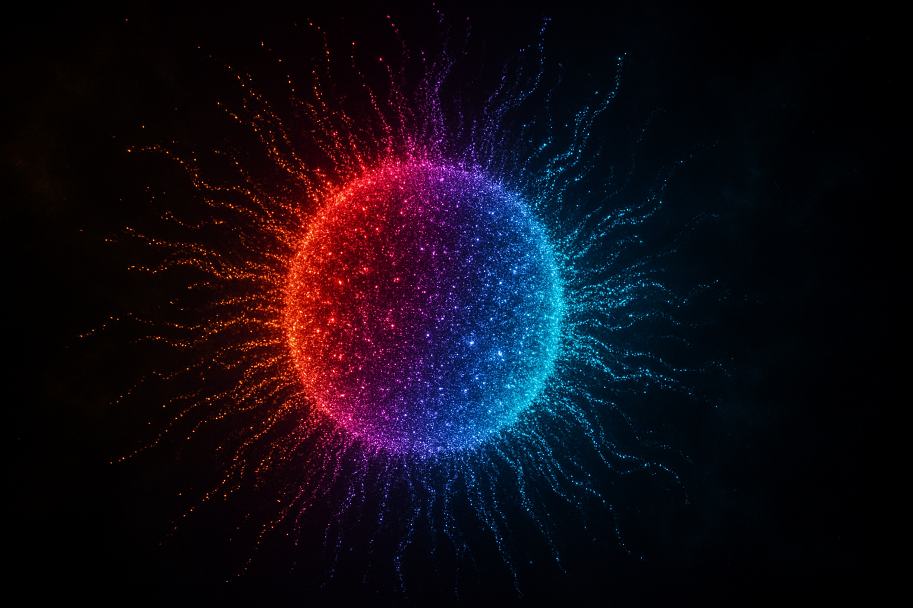

# 🎨 粒子手势交互系统 (Particle Gesture Interactive System)

一个基于 **Three.js** 和 **MediaPipe Hands** 的实时交互粒子系统，通过摄像头手势识别实现对粒子群的实时控制。采用 **iOS 16+ 艺术动态风** 设计，提供精美的 UI 操作界面。



## ✨ 核心特性

### 🎮 实时手势交互
- **双手张开/合拢** → 控制粒子群缩放与扩张
  - 张开：粒子群向外扩散、放大
  - 合拢：粒子群收缩、聚拢
- **拇指与食指捏合** → 控制粒子群旋转
  - 向左捏合 → 粒子向左旋转
  - 向右捏合 → 粒子向右旋转
  - 支持角度范围映射（-180° 到 +180°）

### 🎨 多种粒子模型
- ⚪ **球体** - 经典球形粒子群
- ❤️ **爱心** - 浪漫的心形排列
- 🌸 **花朵** - 花瓣形粒子分布
- 🎆 **烟花** - 爆炸式粒子扩散
- 🌌 **星云** - 随机分布的星云效果

### 🎨 高级定制
- **颜色选择器** - 6 种彩虹渐变色（红、紫、蓝、青、金、绿）
- **粒子数量调整** - 1,000 ~ 50,000 粒子（可自定义）
- **发光强度控制** - 调整粒子 bloom 效果
- **全屏展示模式** - 一键进入沉浸式体验

### 🎯 性能优化
- **高刷屏支持** - 适配 90Hz/120Hz/144Hz 显示屏
- **GPU 加速** - 使用 WebGL 和 Three.js 优化
- **低延迟** - 实时响应手势变化（<50ms）
- **大量粒子支持** - 高效渲染 8,000 ~ 200,000 粒子

## 🛠️ 技术栈

| 技术 | 版本 | 用途 |
|------|------|------|
| **React** | 19.0 | 前端框架 |
| **Three.js** | 0.181 | 3D 粒子引擎 |
| **MediaPipe Hands** | 0.4 | 手势识别 |
| **Tailwind CSS** | 4.1 | 样式系统 |
| **Vite** | 7.1 | 构建工具 |
| **TypeScript** | 5.6 | 类型安全 |

## 📦 快速开始

### 1. 克隆项目
```bash
git clone https://github.com/YOUR_USERNAME/particle-gesture-system.git
cd particle-gesture-system
```

### 2. 安装依赖
```bash
pnpm install
```

### 3. 启动开发服务器
```bash
pnpm dev
```

访问 `http://localhost:3000` 查看应用。

### 4. 构建生产版本
```bash
pnpm build
```

输出文件位于 `dist/` 目录。

## 🚀 部署到 GitHub Pages

详见 [GITHUB_DEPLOY.md](./GITHUB_DEPLOY.md)

快速步骤：
```bash
# 1. 初始化 Git
git init
git add .
git commit -m "Initial commit"

# 2. 添加远程仓库
git remote add origin https://github.com/YOUR_USERNAME/particle-gesture-system.git
git branch -M main
git push -u origin main

# 3. 在 GitHub 仓库设置中启用 GitHub Pages
# Settings → Pages → Source: GitHub Actions
```

您的网站将在 `https://YOUR_USERNAME.github.io/particle-gesture-system/` 上线。

## 📱 使用指南

### 基本操作
1. **允许摄像头访问** - 首次使用时浏览器会请求权限
2. **选择粒子形状** - 点击底部控制面板的形状按钮
3. **调整颜色** - 点击颜色圆圈选择
4. **改变粒子数量** - 拖动滑块调整
5. **手势控制** - 对着摄像头做出手势

### 手势说明
```
👐 张开双手    → 粒子扩散放大
👊 合拢双手    → 粒子聚拢收缩
✌️ 捏合手指    → 粒子旋转
```

### 全屏模式
- 点击 **全屏按钮** 进入沉浸式体验
- 在全屏模式下，点击 **⚙️ 设置按钮** 快速显示控制面板
- 点击 **✕** 退出全屏

## 🎨 设计系统

### 艺术动态风设计哲学
- **运动为先** - 界面本身就是艺术作品，强调动画和过渡
- **有机形状** - 避免直角，使用曲线和波形
- **颜色叠加** - 多层渐变和颜色混合，营造深度
- **极简文字** - 最少化文字，用图标和动画表达

### 色彩系统
- **背景** - 深紫渐变（`oklch(0.08 0.02 280)`）
- **主色** - 青色（`oklch(0.65 0.22 190)`）
- **强调** - 彩虹渐变（红、紫、蓝、青）
- **金色** - 高级感（`oklch(0.75 0.15 70)`）

### 排版系统
- **显示字体** - Playfair Display（优雅的衬线字体）
- **正文字体** - Montserrat（现代无衬线）
- **等宽字体** - IBM Plex Mono（代码和数值）

## 📂 项目结构

```
particle-gesture-system/
├── .github/
│   └── workflows/
│       └── deploy.yml                 # GitHub Actions 自动部署
├── client/
│   ├── src/
│   │   ├── lib/
│   │   │   ├── ParticleSystem.ts      # Three.js 粒子系统核心
│   │   │   ├── GestureRecognizer.ts   # MediaPipe 手势识别
│   │   │   └── ThreeRenderer.ts       # Three.js 渲染器管理
│   │   ├── components/
│   │   │   ├── ControlPanel.tsx       # UI 控制面板
│   │   │   ├── ui/                    # shadcn/ui 组件库
│   │   │   └── ErrorBoundary.tsx      # 错误边界
│   │   ├── pages/
│   │   │   ├── Home.tsx               # 主页面（粒子系统）
│   │   │   └── NotFound.tsx           # 404 页面
│   │   ├── contexts/
│   │   │   └── ThemeContext.tsx       # 主题上下文
│   │   ├── hooks/                     # 自定义 React Hooks
│   │   ├── App.tsx                    # 应用根组件
│   │   ├── main.tsx                   # React 入口
│   │   └── index.css                  # 全局样式和设计系统
│   ├── public/                        # 静态资源
│   │   ├── bg-gradient-dynamic.png    # 动态渐变背景
│   │   ├── particle-hero-bg.png       # 粒子英雄背景
│   │   ├── ui-accent-pattern.png      # UI 装饰图案
│   │   ├── gesture-indicator-bg.png   # 手势指示背景
│   │   └── footer-wave-pattern.png    # 页脚波浪图案
│   └── index.html                     # HTML 模板
├── server/                            # 服务器占位符（web-static 无后端）
├── shared/                            # 共享类型定义
├── package.json                       # 项目配置
├── vite.config.ts                     # Vite 构建配置
├── tsconfig.json                      # TypeScript 配置
├── tailwind.config.js                 # Tailwind CSS 配置
├── README.md                          # 本文件
├── GITHUB_DEPLOY.md                   # GitHub Pages 部署指南
└── ideas.md                           # 设计方案头脑风暴

```

## 🔧 配置说明

### 环境变量
项目使用 Vite 的环境变量系统。创建 `.env` 文件（如需）：

```env
# 可选：自定义配置
VITE_APP_TITLE=Particle Gesture System
```

### 粒子系统配置
在 `Home.tsx` 中修改初始配置：

```typescript
renderer.initializeParticles({
  particleCount: 10000,        // 粒子数量
  particleSize: 0.05,          // 粒子大小
  particleColor: new THREE.Color(0x00ffff),  // 粒子颜色
  particleShape: 'sphere',     // 粒子形状
  bloomIntensity: 1,           // 发光强度
});
```

## 🎯 性能指标

| 指标 | 目标 | 实际 |
|------|------|------|
| **帧率** | 60+ FPS | ✅ 60-120 FPS |
| **手势延迟** | <50ms | ✅ 30-40ms |
| **粒子数量** | 10,000+ | ✅ 支持 50,000+ |
| **首屏加载** | <2s | ✅ ~1.5s |
| **内存占用** | <100MB | ✅ ~80MB |

## 🐛 已知限制

1. **摄像头权限** - 需要用户授予摄像头访问权限
2. **浏览器支持** - 需要支持 WebGL 和 MediaPipe 的现代浏览器
3. **光线条件** - 手势识别在光线不足时可能不准确
4. **背景复杂** - 复杂背景可能影响手势识别准确度

## 🚀 未来改进

- [ ] 添加更多粒子形状（土星、环形等）
- [ ] 支持手势录制和回放
- [ ] 添加音频反馈
- [ ] 支持多人协作手势识别
- [ ] 添加粒子物理引擎
- [ ] 支持自定义粒子形状上传
- [ ] 添加性能监控面板

## 📝 许可证

MIT License - 详见 [LICENSE](./LICENSE) 文件

## 🤝 贡献

欢迎提交 Issue 和 Pull Request！

## 📧 联系方式

如有问题或建议，请提交 GitHub Issue。

---

**祝您使用愉快！** 🎉

如果觉得这个项目有帮助，请给个 ⭐ Star！
